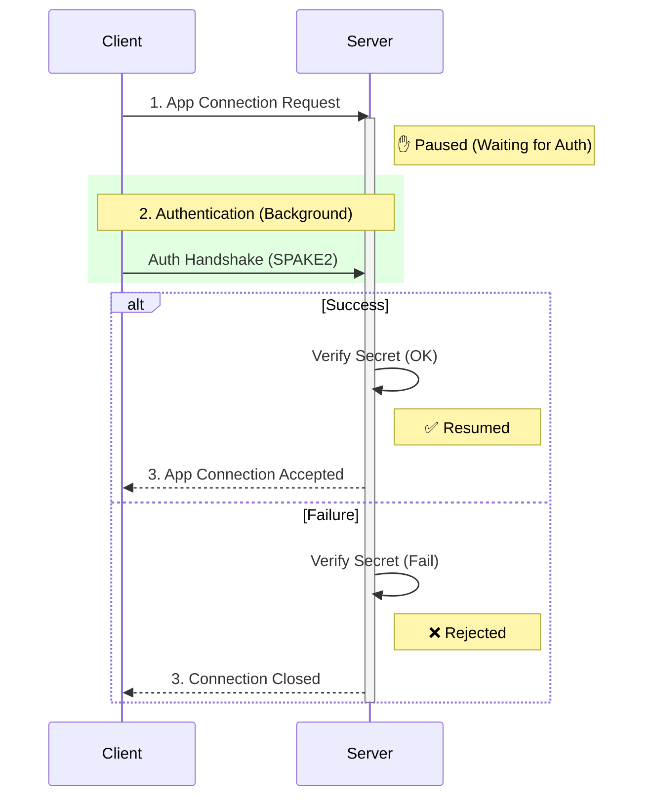

# iroh-auth

[](https://crates.io/crates/iroh-auth)
[](https://docs.rs/iroh-auth)
[](https://github.com/rustonbsd/iroh-auth/actions)

Pre-Shared Key (PSK) authentication middleware for [iroh](https://github.com/n0-computer/iroh).

Ensure that only peers knowing a shared secret can connect to your iroh nodes. This crate implements `EndpointHooks` to intercept connection attempts, perform a SPAKE2 password authenticated key exchange, and gate access to your application protocols.

## Features

- **Integration**: Works via standard `iroh::EndpointHooks`
- **Security**: Uses [SPAKE2](https://github.com/RustCrypto/PAKEs/tree/master/spake2) (Simple Password Authenticated Key Exchange) to verify secrets
- **Side-channel Resistant**: Constant time comparison for sensitive operations
- **Zero-Config**: No certificates or complex PKI required, just a shared secret

## Installation

Add this to your `Cargo.toml`:

```toml
[dependencies]
iroh = "0.96"
iroh-auth = "0.1"
```

## Usage

Integrating `iroh-auth` involves four steps:
1. Initialize the `Authenticator` with your secret
2. Register the authenticator as an endpoint hook
3. Set the bound endpoint on the authenticator
4. Add the authenticator's protocol handler to your router

```rust
// See /examples/basic.rs for a complete example
use iroh::{Endpoint, protocol::Router};
use iroh_auth::Authenticator;

#[tokio::main]
async fn main() -> Result<(), String> {
    // 1. Create the authenticator with a shared secret
    let auth = Authenticator::new("my-super-secret-password");

    // 2. Build the endpoint with the auth hooks
    let endpoint = Endpoint::builder()
        .hooks(auth.clone())
        .bind()
        .await.map_err(|e| e.to_string())?;

    // 3. The authenticator needs a reference to the bound endpoint 
    // to initiate authentication handshakes.
    auth.set_endpoint(&endpoint);

    // 4. Register the auth protocol handler
    let router = Router::builder(endpoint)
        .accept(Authenticator::ALPN, auth.clone())

        // Register your actual application protocols here
        .accept(b"/my-app/1.0", MyProtocolHandler)
        .spawn();
    
    // ... run your application
    router.shutdown().await.map_err(|e| e.to_string())?;
    Ok(())
}
```

## How It Works

When a connection is attempted, `iroh-auth` pauses the application handshake and initiates a parallel authentication channel.



1.  **Interception**: The `before_connect` hook on the initiator spawns a background task to establish a dedicated authentication connection on `Authenticator::ALPN`
2.  **Handshake**: The peers perform a SPAKE2 handshake. This proves possession of the shared password without sending the password itself
3.  **Gating**: The `after_handshake` hook on the receiver blocks the application connection until the authentication handshake completes successfully. If it times out or fails, the connection is rejected

## Protocol Details

- **ALPN**: `/iroh/auth/0.1`
- **Cipher Suite**: ed25519-dalek group operations with SHA-512 HKDF
- **Context Separation**: distinct keys derived for `accept` and `open` confirmation steps to prevent replay attacks

## License

This project is licensed under either of

 * Apache License, Version 2.0, ([LICENSE-APACHE](LICENSE-APACHE) or http://www.apache.org/licenses/LICENSE-2.0)
 * MIT license ([LICENSE-MIT](LICENSE-MIT) or http://opensource.org/licenses/MIT)

at your option.
